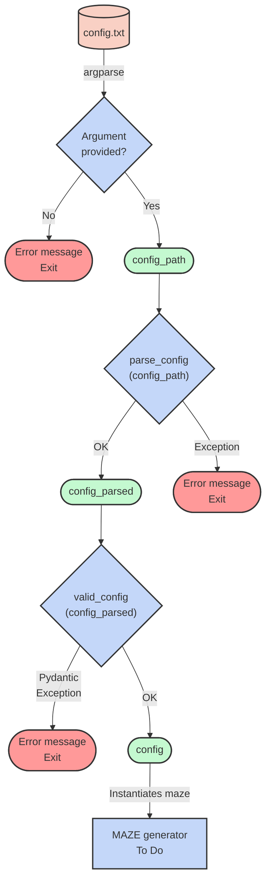
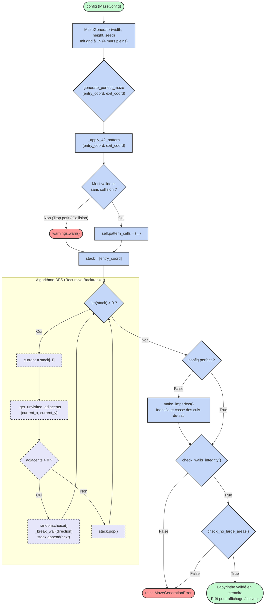

*This project has been created as part of the 42 curriculum
by emarette and vadamavi.*


---------------------==notes au fil de l'eau, à corriger/rédiger/traduire... ==---------------------------


## RÉPARTITION des TÂCHES et planification

emarette = solver, display (parties traitées par précédent binôme, cf retry)  
vadamavi = parsing, algo, makefile, readme  
flake8 & mypy = les 2, pdt codage

planif (...ooops) : ToDo = diagramme gantt


---


## STRUCTURE du projet

arborescence provisoire :
```text
A_Maze_ing/
│
├── parsing/             TODO
│   │
│   ├── `config_parser.py`
│   │   ├── parse_config(file_path: str) -> dict[str, str]:
│   │   └── ouvrir fichier, ignorer commentaires, nettoyer espaces, gérer casse
│   │
│   ├── `models.py`
│   │   ├── class MazeConfig(BaseModel):
│   │       ├── parse_coordinates(cls, value: Any) -> tuple[int, int] | Any:
│   │       ├── lower_display_mode(cls, value: Any) -> Any:
│   │       ├── check_extension(cls, value: str) -> str:
│   │       ├── validate_config_rules(self) -> 'MazeConfig':
│   │       └── 
│
├── display/
│   │
│   ├── 
│   │   ├── ToDo
│   │   └──
│
├── mazegen/
│   │
│   ├── `__init__.py`
│   │   ├── ToDo
│   │   └──
│   │
│   ├── generator.py
│   │   ├── class MazeGenerator:
│   │       ├── __init__(self, width: int, height: int, seed: int | None = None) -> None:
│   │       ├── _break_wall(self, x: int, y: int, direction: int) -> None:
│   │       ├── _get_unvisited_adjacents(self, x: int, y: int) -> list[tuple[int, int, int]]:
│   │       ├── _apply_42_pattern(self, entry_coord: tuple[int, int], exit_coord: tuple[int, int]) -> None:
│   │       ├── generate_perfect_maze(self, entry_coord: tuple[int, int], exit_coord: tuple[int, int]) -> None:
│   │       ├── make_imperfect(self, percent_to_break: float = 0.4) -> None:
│   │       ├── check_walls_integrity(self) -> bool:
│   │       ├── check_no_large_areas(self) -> bool:
│   │       └── 
│   │
│   └── exceptions.py
│   │   ├── class MazeGenerationError(Exception):
│   │       ├── pass
│   │       └── 
│   │
│   └── solver.py ??
│   │   ├── ToDo (enzo)
│   │   └──
│
│
├── tests/
│   │
│   ├── test_generator.py
│   │   ├── ToDo (valerie)
│   │   └──
│   │
│   ├── test_ceci.py
│   │   ├── ToDo (valerie)
│   │   └──
│   │
│   └── test_cela.py
│   │   ├── ToDo (valerie)
│   │   └──
│
│
├── `.flake8`
│   ├── necessary to exclude some directories
│   └──
│
├── `.gitignore`
│   ├── Work in progress...
│   └──
│
├── `.python-version`
│   ├── généré (3.10) par "uv init"
│   └── https://docs.astral.sh/uv/concepts/python-versions/#python-version-files
│
├── `a_maze_ing.py`
│   ├── main(config_path: str) -> None:
│   └── 
│
├── `config.txt`
│   ├── default settings for the maze generator
│   └── ? add SEED and DISPLAY_MODE ?
│
├── display.py
│   ├── ToDo (enzo)
│   └── 
│		? SCINDER EN 2 composants fichiers / classes ?
│		[A] GESTION DES EVENEMENTS : 
│		intercepter les interactions de l'utilisateur,
│		les traduire en commandes,
│		/!\ ne dessine rien.
│		[B] MOTEUR DE RENDU : 
│		n'a besoin que de l'objet (dans son état actuel) labyrinthe,
│		pour le dessiner à l'écran.
│		[] script principal = contrôleur pour orchestrer :
│			lire les événements,
│			mettre à jour les données du labyrinthe,
│			ordonner au moteur de rendu de rafraîchir l'écran.
│
├── `Makefile`
│   ├── to automate : all, install, run, build, debug, lint, lint-strict, clean
│   └── update, test, fclean
│
├── `pyproject.toml`
│   ├── généré (seulement structure basique) par "uv init"
│   └── https://packaging.python.org/en/latest/guides/writing-pyproject-toml/
│
└── README.md
│   ├── généré (vierge) par "uv init"
│   ├── inProgress (valerie)
│   └── 
│
└── `utils.py`
│   ├── print_italic() print_green() print_red()
│   ├── debug_draw_maze(grid: list[list[int]], width: int, height: int) -> None:
│   └── 
│
└── `uv.lock`
│   ├── contains exact versions of all dependencies, including sub-dependencies
│   └── 
```

---


## ENVIRONNEMENT et DÉPENDANCES

Ce projet utilise `uv` comme gestionnaire de paquets et d'environnements virtuels.

### Pourquoi `uv`

* **Performance :** Écrit en Rust, `uv` est significativement plus rapide que les outils standards pour la résolution et l'installation des dépendances.
* **Automatisation :** `uv` rend inutile l'activation manuelle de l'environnement virtuel, il crée et gère automatiquement le dossier `.venv` dès qu'une commande d'exécution ou d'installation le nécessite.
* **Portabilité :** `uv` gère nativement les spécificités des chemins selon l'OS , d'où un `Makefile` universel sans préciser les chemins (`.venv/bin/...` sous Linux/macOS, `.venv\Scripts\...` sous Windows, etc.).

> **Note d'installation :** Si `uv` n'est pas encore installé sur votre système, utilisez le script d'installation officiel autonome plutôt que `pip` :
> ```bash
> curl -LsSf https://astral.sh/uv/install.sh | sh
> ```

### Initialisation de l'architecture

La structure initiale de ce projet a été générée via la commande `uv init`, qui a mis en place :

* **`README.md`** : Fichier -vierge- pour la documentation du projet.
* **`main.py`** : Script générique d'amorçage, remplacé par le point d'entrée `a_maze_ing.py`.
* **`pyproject.toml`** : Fichier central de configuration du projet, incluant notamment :
	* `requires-python` : Version minimale requise de l'interpréteur, ici `>= 3.10`.
	* `dependencies` : Liste -vierge- des paquets tiers nécessaires à l'exécution du programme, à compléter via `uv add`.

### Ajout des dépendances

`uv add` se charge de mettre à jour le fichier pyproject.toml, résoudre les dépendances (création du uv.lock) et génère automatiquement l'environnement virtuel (.venv) pour y installer les paquets.
Par exemple :
```bash
uv add --dev flake8 mypy pytest
uv add pydantic
```

---


## GÉNÉRATION du LABYRINTHE

Le coeur logique de ce projet repose sur la classe `MazeGenerator`, qui instancie et sculpte la grille de jeu.
Son implémentation suit des standards stricts de développement Python, par souci de performance et de fiabilité.

### Représentation Binaire (Bitwise)

Le sujet impose que chaque mur soit représenté par une puissance de 2 :

* **Nord** : 1 (0001)
* **Est** : 2 (0010)
* **Sud** : 4 (0100)
* **Ouest** : 8 (1000)

Plutôt que d'utiliser des objets complexes ou des listes imbriquées pour définir l'état d'une cellule, le labyrinthe repose sur l'utilisation des opérations binaires (masques de bits).

+ L'utilisation des puissances de 2 permet de combiner ces valeurs dans un seul entier (ex : N + E = 1 + 2 = 3) sans perte d'information.
+ Une cellule intacte (entourée de 4 murs) est donc initialisée à **15** (1+2+4+8).
+ Ouvrir un passage, par ex vers l'Est, se fait simplement en appliquant un masque inverse sur la cellule actuelle (`cell &= ~E`) et sur la cellule adjacente : cela utilise un minimum de mémoire et offre des performances optimales lors de la navigation dans la grille.

### Algorithme de Génération

La création du labyrinthe parfait s'appuie sur l'algorithme du **Recursive Backtracker** (Parcours en Profondeur / DFS) :

1. Une pile (*stack*) conserve l'historique des déplacements.
2. À chaque itération, l'algorithme casse un mur vers un voisin valide et l'ajoute à la pile.
3. En cas de cul-de-sac (aucun voisin non visité), l'algorithme dépile (*backtrack*) jusqu'à retrouver une cellule offrant de nouvelles possibilités.

### Découplage et Robustesse

L'architecture de la classe respecte le principe de responsabilité unique (SRP) :

* **Pattern 42** : Les cellules réservées pour le motif sont stockées dans une structure de données annexe, un `set` pour une recherche en O(1), que l'algorithme a pour instruction stricte de contourner. Le set est déclaré en constante de classe pour ne pas encombrer l'espace mémoire de chaque instance de la classe.
* **Encapsulation des Erreurs** : aucun `print` ou `sys.exit` dans le générateur, tous les dysfonctionnements (motif hors limites, incohérence de grille...) génèrent des avertissements standards via le module `warnings` ou lèvent des exceptions métier. => le point d'entrée principal (`a_maze_ing.py`) garde le contrôle absolu sur le flux d'exécution et l'affichage des erreurs.

---

## DIAGRAMMES d'architecture
pour cartographier les appels de méthodes et les branchements logiques

### Parsing :



### MazeGenerator :

