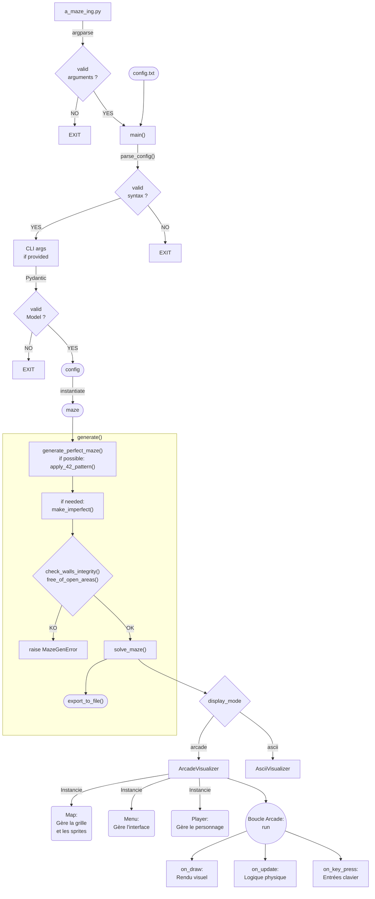

*This project has been created as part of the 42 curriculum by emarette and vadamavi.*

# Description du projet

### But du projet

Ce projet a été réalisé dans le cadre du tronc commun de 42, conformément au sujet  "A_Maze-ing v2.2".

La consigne était d'implémenter en Python un générateur de labyrinthes, à partir d'un fichier de configuration :
+ générer des labyrinthes (parfait, et imparfait avec au maximum 2 culs de sac) ;
+ trouver le chemin le plus court de l'entrée à la sortie ;
+ exporter dans un fichier texte le labyrinthe et sa solution ;
+ fournir une représentation visuelle du labyrinthe ;
+ organiser le code afin que la logique de génération/solution puisse être réutilisée ultérieurement.

Pédagogiquement, ce projet avait pour objectif de travailler les *structures de données*, l'*analyse syntaxique* et les *algorithmes de graphes*. De manière optionnelle, il a également permis l'usage *Arcade* et la création de *tests unitaires*.


### Sommaire

[1. Instructions](<#1-instructions>)

[2. Fichier de configuration](<#2-fichier-de-configuration>)

[3. Fichier de sortie](<#3-fichier-de-sortie>)

[4. Module réutilisable](<#4-module-réutilisable>)

[5. Architecture](<#5-architecture>)

[6. Algorithmique](<#6-algorithmique>)

[7. Affichage / interactions](#7-affichage--interactions)

[8. Bonus](<#8-bonus>)

[9. Gestion d'équipe et de projet](#9-gestion-déquipe-et-de-projet)

# 1/ Instructions


### Prérequis
- Python 3.10 ou supérieur
- [uv](https://docs.astral.sh/uv/getting-started/installation/) pour la gestion des dépendances
```bash
  curl -LsSf https://astral.sh/uv/install.sh | sh
```
- Dépendances système également requises par pyglet/arcade pour décoder les fichiers audio .mp3 (souvent absentes par défaut sous WSL), à installer si besoin avec les commandes suivantes :
```bash
sudo apt update
sudo apt install -y ffmpeg libavcodec-dev libavformat-dev libavutil-dev libswresample-dev
```

### Installation

```bash
git clone <url_du_repo>
cd <nom_du_repo>
make install
```

### Exécution

```bash
make run
```

ou bien, pour ajouter des paramètres nommés :
```bash
uv run a_maze_ing.py config.txt --perfect=True --seed=33 --display-mode=ascii
```

+ `a_maze_ing.py` est le point d'entrée du programme.
+ `config.txt` est le fichier de configuration, un [exemple par défaut](config.txt) est fourni à la racine du dépôt.
+ `perfect`, `seed` et `display-mode` sont des paramètres nommés facultatifs, le cas échéant ils écrasent les valeurs du fichier `config.txt`.

### Makefile

|Cible|Rôle|Obligatoire|
|---|---|---|
|`all`|Installe les dépendances et lance le programme principal|   |
|`install`|Installe les dépendances du projet|✔️|
|`update`|force la mise à jour de uv.lock si besoin|   |
|`test`|Lance les tests pytest|   |
|`run`|Lance le programme principal|✔️|
|`build`|génère l'archive|✔️|
|`debug`|Lance le programme en mode debug (`pdb`)|✔️|
|`lint`|Exécute `flake8` et `mypy` (règles obligatoires)|✔️|
|`lint-strict`|Exécute `flake8` et `mypy --strict`|✔️|
|`clean`|Supprime les fichiers temporaires (`__pycache__`, `.mypy_cache`…)|✔️|
|`fclean`|Supprime l'environnement virtuel (`.venv`, `uv.lock`…)|   |

[Haut page](<#description-du-projet>)

# 2/ Fichier de configuration
Le fichier de configuration contient une paire `CLÉ=VALEUR` par ligne. Les lignes commençant par `#` sont des commentaires et sont ignorées.

| Clé            | Description                             | Exemple                | Obligatoire |
| -------------- | --------------------------------------- | ---------------------- | ----------- |
| `WIDTH`        | Largeur du labyrinthe (en cellules)     | `WIDTH=20`             | ✔️          |
| `HEIGHT`       | Hauteur du labyrinthe                   | `HEIGHT=15`            | ✔️          |
| `ENTRY`        | Coordonnées de l'entrée (x,y)           | `ENTRY=0,0`            | ✔️          |
| `EXIT`         | Coordonnées de la sortie (x,y)          | `EXIT=19,14`           | ✔️          |
| `OUTPUT_FILE`  | Nom du fichier de sortie                | `OUTPUT_FILE=maze.txt` | ✔️          |
| `PERFECT`      | Labyrinthe parfait (un seul chemin)     | `PERFECT=True`         | ✔️          |
| `SEED`         | Graine de génération (reproductibilité) | `SEED=42`              | optionnel   |
| `DISPLAY_MODE` | Mode d'affichage (`arcade` / `ascii`)   | `DISPLAY_MODE=arcade`  | optionnel   |

La taille maximum de `WIDTH` et `HEIGHT` est 100.

Par défaut : `SEED` = `None` and `DISPLAY_MODE` = `ascii`.

En cas d'erreur de syntaxe ou de valeur invalide, le programme affiche la raison de l'erreur puis se ferme.

[Haut page](<#description-du-projet>)

# 3/ Fichier de sortie

Chaque cellule est encodée par un digit hexadécimal représentant l'état de ses 4 murs : 

| Bit (LSB → MSB) | Direction |
| --------------- | --------- |
| 0               | Nord      |
| 1               | Est       |
| 2               | Sud       |
| 3               | Ouest     |

Un mur fermé positionne le bit correspondant à `1` :

Exemple 1 :  *0x*3 (*0b*0011) : murs Nord et Est fermés

Exemple 2 :  *0x*E (*0b*1110) : murs Est, Sud et Ouest fermés

Le fichier de sortie contient :
+ toutes les cellules du labyrinthes, écrites ligne par ligne et codées en hexadécimal.

Ensuite, après une ligne vide, trois lignes supplémentaires précisent :
+ les coordonnées d'entrée,
+ les coordonnées de sortie,
+ le plus court chemin, avec une suite de lettres pour désigner la direction à prendre (`N`, `E`, `S`, `W`).

Exemple de fichier de sortie :

```text
9395551393
8445116C6A
8539069556
83C2C12953
A83A96C692
C6C4455546

0,0
9,5
SSEESESSEEEEEE
```

[Haut page](<#description-du-projet>)

# 4/ Module réutilisable

La logique de génération est isolée dans la classe **`MazeGenerator`** (`src/mazegen.py`).
Elle est packagée en un module autonome (`mazegen-*.whl` / `mazegen-*.tar.gz`) fourni à la racine du dépôt et installable via `pip`.
```bash
# Installer le package
pip install mazegen-0.1.0-py3-none-any.whl
```

### Exemple d'utilisation
```python
from mazegen import MazeGenerator

# instancie le labyrinthe
maze = MazeGenerator(
    width=5,
    height=5,
    entry_coord=(0, 0),
    exit_coord=(4, 4),
    perfect=True,
    seed=33,
    output_file='maze.txt'
)

# génère le labyrinthe et le fichier maze.txt (grille du labyrinthe et sa solution)
maze.generate()

# structure générée (le bitmask de chaque cellule décrit l'état de ses murs)
print(maze.grid)
# [[13, 5, 3, 9, 3], [9, 7, 10, 14, 10], [8, 5, 6, 9, 6], [10, 9, 3, 12, 3], [12, 6, 12, 5, 6]]

# plus court chemin entre l'entrée et la sortie (directions à suivre)
print(maze.exit_path)
# EESSWWSSENESEE
```

> **A noter** :
La consigne inclut que le labyrinthe intègre un pattern de cellules closes pour afficher le motif "42" : la console est susceptible d'afficher que la taille du labyrinthe ne l'a pas permis : "*This maze is too small to display the '42' pattern*".

> **IMPORTANT** :
Contrairement à l'application, le package seul ne gère pas les arguments d'un mauvais type ou manquants, mais uniquement les valeurs inadéquates pour la création d'un labyrinthe valide.


[Haut page](<#description-du-projet>)

# 5/ Architecture
##### Fichiers

```text
.
├── .flake8
├── .gitignore
├── .python-version
├── pyproject.toml
├── uv.lock
├── Makefile
├── README.md
├── config.txt                        # Fichier de configuration par défaut
├── a_maze_ing.py                     # Point d'entrée (main)
├── src/
│   ├── __init__.py
│   ├── mazegen.py                    # Génération (DFS) et résolution (BFS) du labyrinthe
│   └── maze_app
│       ├── __init__.py
│       ├── utils/                    # Some utility functions
│       │   ├── __init__.py
│       │   └── utility_funcs.py
│       ├── parsing/                  # Lecture et validation (Pydantic) du fichier de config
│       │   ├── __init__.py
│       │   ├── config_main.py
│       │   ├── config_parser.py
│       │   └── models.py
│       └── display/                  # Visualiseurs ASCII et graphique (arcade)
│           ├── __init__.py
│           ├── visualizer.py
│           ├── ascii_visualizer.py
│           ├── arcade_visualizer.py
│           ├── map.py                # Grille et sprites
│           ├── menu.py               # Interface utilisateur
│           ├── player.py             # Déplacement du personnage
│           ├── sprite/
│           │   ├── background.jpeg
│           │   ├── bordure.png
│           │   ├── exit.png
│           │   ├── path.png
│           │   ├── player.png
│           │   ├── tilemap.png
│           │   └── win.png
│           └── sound/
│               └── music.mp3
├── doc/
│   ├── display_ascii.png
│   ├── display_arcade.png
│   ├── wall_0011.png
│   ├── wall_1110.png
│   └── ToDo.md
└── tests/
    ├── test_parsing.py
    └── test_models.py
```

##### Flux global


[Haut page](<#description-du-projet>)

# 6/ Algorithmique

### Génération

Pour générer le labyrinthe, 4 algorithmes **générateurs de labyrinthes parfaits** ont été comparés :

| Algorithme             | Difficulté | Texture                     | Biais       | Vitesse     |
| ---------------------- | ---------- | --------------------------- | ----------- | ----------- |
| Binary Tree            | ★          | Diagonale marquée           | Fort        | Très rapide |
| Recursive Backtracking | ★          | Longs couloirs sinueux      | Moyen       | Rapide      |
| Prim                   | ★★         | Branches courtes, organique | Faible      | Rapide      |
| Kruskal                | ★★★        | Très homogène               | Très faible | Moyen       |

Notre choix s'est porté sur le Backtracking récursif (DFS randomisé) :
+ génère naturellement un labyrinthe parfait
+ plutôt facile à coder, idéal pour un 1er projet
+ rapide, faible consommation mémoire relative, complexité en O(n)
+ génère très peu de branches, ressemble à un "labyrinthe classique"
+ beaucoup de longs couloirs, donc peu de culs de sacs → ne génère pas de zone ouverte de 3x3 lors du braiding

Principe :
+ Creuse un chemin au hasard en avançant dans une direction aléatoire ; quand on est bloqué, on revient en arrière (backtrack) jusqu'à trouver une case avec une issue.

Le labyrinthe est généré par **`MazeGenerator`** (`src/mazegen.py`) :

1. `generate_perfect_maze()` crée un labyrinthe parfait , `_apply_42_pattern()` intègre le pattern "42" lorsque sa taille le permet.
2. Si `PERFECT=False`, `make_imperfect()` supprime tous les culs de sac et rend le labyrinthe imparfait.
3. `check_walls_integrity()` et `free_of_open_areas()` vérifient que le labyrinthe créé est cohérent et respecte les consignes.
4. `solve_maze()` trouve le chemin le plus court et `export_to_file()` génère le fichier `OUTPUT_FILE`

### Résolution

Pour **trouver le chemin le plus court**, 3 algorithmes solveurs de labyrinthes ont été comparés :

| Critère            | BFS         | Dijkstra   | A*                                 |
| ------------------ | ----------- | ---------- | ---------------------------------- |
| Gère les poids     | Non         | Oui        | Oui                                |
| Nœuds explorés     | Beaucoup    | Beaucoup   | Peu                                |
| Complexité         | O(n)        | O(n log n) | O(n log n), en pratique bien moins |
| Simplicité du code | Très simple | Simple     | Modérée (heuristique à écrire)     |

Notre choix s'est porté sur le BFS :
+ dans notre labyrinthe, tous les déplacements ont le même coût ;
+ il est simple à implémenter ;
+ pour un labyrinthe affiché à l'écran, donc de taille raisonnable, la différence de performance avec A* sera imperceptible.

Principe :
+ Explore le graphe niveau par niveau, en traitant tous les voisins à distance _k_ avant de passer à distance _k+1_. 

Le labyrinthe est résolu par **`MazeGenerator`** (`src/mazegen.py`) :
1. `solve_maze()` trouve le chemin le plus court.


[Haut page](<#description-du-projet>)

# 7/ Affichage / interactions

Deux modes de rendu sont disponibles, sélectionnables via la configuration (`DISPLAY_MODE`).

### ASCII

Rendu texte directement dans le terminal :


### Arcade

En bonus, rendu graphique via la librairie [arcade](https://api.arcade.academy/), avec sprites (murs, joueur, sortie, chemin) et un menu interactif :


**Commandes clavier** :

+ Flèches :arrow_up: / :arrow_down: pour se déplacer dans le menu
+ Espace pour valider
+ Flèches :arrow_up: / :arrow_down: et :arrow_left: / :arrow_right: pour déplacer le joueur dans le labyrinthe
+ Echap pour quitter le mode joueur

[Haut page](<#description-du-projet>)

# 8/ Bonus
- aucun cul-de-sac dans les labyrinthes imparfaits
- display avec la librairie Arcade
- configuration modifiable en ligne de commande : seed, display-mode, perfect
- déplacements du joueur (Arcade)
- musique (Arcade)
- tests unitaires avec Pytest

[Haut page](<#description-du-projet>)

# 9/ Gestion d'équipe et de projet

### Répartition des rôles
Emarette avait déjà validé le projet, nous nous sommes donc réparti le travail de façon à ce qu'il ne réalise pas les mêmes tâches qu'avec son précédent binôme.

| Membre   | Rôle                                                             |
| -------- | ---------------------------------------------------------------- |
| emarette | affichage Ascii, affichage Arcade                                |
| vadamavi | makefile, pyproject.toml, parsing, generator, solver, readme, build|
| both     | .gitignore, architecture, Flake8 et mypy, type hints, docstrings |

### Planning prévisionnel et évolution concrète
Nous avions estimé le temps nécessaire pour les tâches indispensables mais pas fixé d'échéance compte tenu du contexte :
+ bonus à définir ;
+ congés personnels car période estivale ;
+ disponibilité variable des clusters pendant la piscine.


### Ce qui a pris plus de temps que prévu :
+ la modification du sujet (v2.1 -> v2.2) ;
+ l'appropriation / approfondissement de certaines notions (uv, pytest, arcade, git...) ;
+ la mise en place de tests unitaires ;
+ la rédaction de ce readme.


### Ce qui a (presque) bien fonctionné
+ Mise en place d'une ToDo list partagée ;
+ Usage de branches pour collaborer avec git.

### Axes d'amélioration
+ L'architecture initialement définie a été remise en question et modifiée deux fois pendant l'implémentation du projet ;
+ Le readme pourrait être partiellement rédigé à l'aide de l'IA.


### Outils collaboration et développement

Pour collaborer, nous avons fait des points d'étape en **présentiel** lorsque nos disponibilités coïncidaient, communiqué via **Slack** et mutualisé le code sur **Github**.

Le développement a été effectué avec [VSCode](https://code.visualstudio.com/), la majorité des traductions en anglais avec [deepl](https://www.deepl.com/fr/translator) et la prise de notes avec [Obsidian](https://obsidian.md/).

**Outils spécifiques** utilisés : `uv`, `pydantic`, `pytest`, `arcade`, `colorama`, `flake8`, `mypy`.

### Ressources
+ Documentation officielle [uv](https://docs.astral.sh/uv/guides/projects/)
+ Documentation officielle [Pydantic](https://docs.pydantic.dev/)
+ Documentation officielle [Pytest](https://docs.pytest.org/en/stable/getting-started.html)
+ uv_build vs hatchling [Medium - Chris Evans](https://medium.com/@dynamicy/python-build-backends-in-2025-what-to-use-and-why-uv-build-vs-hatchling-vs-poetry-core-94dd6b92248f)
+ Wikipedia [Modélisation mathématique d'un labyrinthe](https://fr.wikipedia.org/wiki/Mod%C3%A9lisation_math%C3%A9matique_d%27un_labyrinthe)
+ Python [Opérateurs-"bitwise"](https://datascientist.fr/blog/tutoriel-python-operateurs-bit-a-bit#operateurs-logiques-bit-a-bit)
+ Documentation officielle [arcade](https://api.arcade.academy/)
+ Sprites free to use [pmdcollab.org](https://sprites.pmdcollab.org/)
+ Syntaxe [Markdown](https://docs.framasoft.org/fr/grav/markdown.html)
+ Documentation officielle [Mermaid](https://mermaid.ai/open-source/syntax/flowchart.html)


### Usages IA

Gemini ou Claude ont été utilisés par vadamavi pour :
+ relire et optimiser le Makefile ;
+ synthétiser la comparaison des algorithmes de génération de labyrinthe ;
+ calculer la probabilité d'apparition, dans des labyrinthes générés avec DFS ou Prim (et de taille variable, jusqu'à 150x150), de zones ouvertes d'au moins 3x3 lors du braiding ;
+ debugger la gestion de l'audio par Pyglet sous WSL
+ traduire le ReadMe.


# Licence

Ce projet est distribué sous licence MIT, voir le fichier [LICENSE.md](LICENSE.md) à la racine du dépôt.
