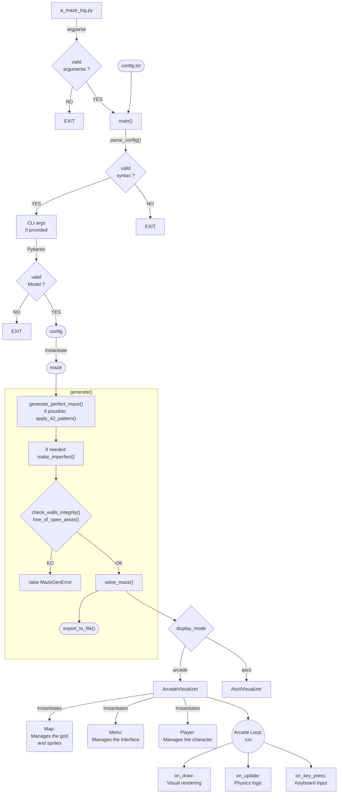

*This project has been created as part of the 42 curriculum by emarette and vadamavi.*

# Project Description

### Project Goal

This project was carried out as part of 42's common core curriculum, in accordance with the "A_Maze-ing v2.2" subject.

The instructions were to implement a maze generator in Python, based on a configuration file:
+ generate mazes (perfect, and imperfect with a maximum of 2 dead ends);
+ find the shortest path from the entrance to the exit;
+ export the maze and its solution to a text file;
+ provide a visual representation of the maze;
+ organize the code so that the generation/solving logic can be reused later.

Pedagogically, this project aimed to work on *data structures*, *parsing*, and *graph algorithms*. Optionally, it also allowed for the use of *Arcade* and the creation of *unit tests*.


### Table of Contents

[1. Instructions](<#1-instructions>)

[2. Configuration File](<#2-configuration-file>)

[3. Output File](<#3-output-file>)

[4. Reusable Module](<#4-reusable-module>)

[5. Architecture](<#5-architecture>)

[6. Algorithms](<#6-algorithms>)

[7. Display / Interactions](#7-display--interactions)

[8. Bonus](<#8-bonus>)

[9. Team and Project Management](#9-team-and-project-management)

# 1/ Instructions


### Prerequisites
- Python 3.10 or higher
- [uv](https://docs.astral.sh/uv/getting-started/installation/) for dependency management
```bash
  curl -LsSf https://astral.sh/uv/install.sh | sh
```
- System dependencies also required by pyglet/arcade to decode .mp3 audio files (often missing by default on WSL), to be installed if needed with the following commands:
```bash
sudo apt update
sudo apt install -y ffmpeg libavcodec-dev libavformat-dev libavutil-dev libswresample-dev
```

### Installation

```bash
git clone <repo_url>
cd <repo_name>
make install
```

### Running

```bash
make run
```

or, to add named parameters:
```bash
uv run a_maze_ing.py config.txt --perfect=True --seed=33 --display-mode=ascii
```

+ `a_maze_ing.py` is the program's entry point.
+ `config.txt` is the configuration file; a [default example](config.txt) is provided at the root of the repository.
+ `perfect`, `seed`, and `display-mode` are optional named parameters; if provided, they override the values in the `config.txt` file.

### Makefile

|Target|Role|Required|
|---|---|---|
|`all`|Installs dependencies and launches the main program|   |
|`install`|Installs the project dependencies|✔️|
|`update`|Forces the update of uv.lock if needed|   |
|`test`|Runs the pytest tests|   |
|`run`|Launches the main program|✔️|
|`build`|Generates the archive|✔️|
|`debug`|Launches the program in debug mode (`pdb`)|✔️|
|`lint`|Runs `flake8` and `mypy` (mandatory rules)|✔️|
|`lint-strict`|Runs `flake8` and `mypy --strict`|✔️|
|`clean`|Removes temporary files (`__pycache__`, `.mypy_cache`…)|✔️|
|`fclean`|Removes the virtual environment (`.venv`, `uv.lock`…)|   |

[Back to top](<#project-description>)

# 2/ Configuration File
The configuration file contains one `KEY=VALUE` pair per line. Lines starting with `#` are comments and are ignored.

| Key            | Description                              | Example                | Required   |
| -------------- | ----------------------------------------- | ---------------------- | ----------- |
| `WIDTH`        | Width of the maze (in cells)              | `WIDTH=20`             | ✔️          |
| `HEIGHT`       | Height of the maze                        | `HEIGHT=15`            | ✔️          |
| `ENTRY`        | Entrance coordinates (x,y)                | `ENTRY=0,0`            | ✔️          |
| `EXIT`         | Exit coordinates (x,y)                    | `EXIT=19,14`           | ✔️          |
| `OUTPUT_FILE`  | Name of the output file                   | `OUTPUT_FILE=maze.txt` | ✔️          |
| `PERFECT`      | Perfect maze (a single path)              | `PERFECT=True`         | ✔️          |
| `SEED`         | Generation seed (reproducibility)         | `SEED=42`              | optional    |
| `DISPLAY_MODE` | Display mode (`arcade` / `ascii`)         | `DISPLAY_MODE=arcade`  | optional    |

The maximum size for `WIDTH` and `HEIGHT` is 100.

Default values: `SEED` = `None` and `DISPLAY_MODE` = `ascii`.

In case of a syntax error or an invalid value, the program displays the reason for the error and then exits.

[Back to top](<#project-description>)

# 3/ Output File

Each cell is encoded by a hexadecimal digit representing the state of its 4 walls:

| Bit (LSB → MSB) | Direction |
| --------------- | --------- |
| 0                | North     |
| 1                | East      |
| 2                | South     |
| 3                | West      |

A closed wall sets the corresponding bit to `1`: 

Example 1: *0x*3 (*0b*0011): North and East walls closed

Example 2: *0x*E (*0b*1110): East, South, and West walls closed

The output file contains:
+ all the cells of the maze, written line by line and encoded in hexadecimal.

Then, after an empty line, three additional lines specify:
+ the entrance coordinates,
+ the exit coordinates,
+ the shortest path, as a sequence of letters indicating the direction to take (`N`, `E`, `S`, `W`).

Example output file:

```text
9395551393
8445116C6A
8539069556
83C2C12953
A83A96C692
C6C4455546

0,0
9,5
SSEESESSEEEEEE
```

[Back to top](<#project-description>)

# 4/ Reusable Module

The generation logic is isolated in the **`MazeGenerator`** class (`src/mazegen.py`).
It is packaged as a standalone module (`mazegen-*.whl` / `mazegen-*.tar.gz`) provided at the root of the repository and installable via `pip`.
```bash
# Install the package
pip install mazegen-0.1.0-py3-none-any.whl
```

### Usage Example
```python
from mazegen import MazeGenerator

# instantiate the maze
maze = MazeGenerator(
    width=5,
    height=5,
    entry_coord=(0, 0),
    exit_coord=(4, 4),
    perfect=True,
    seed=33,
    output_file='maze.txt'
)

# generate the maze and the maze.txt file (maze grid and its solution)
maze.generate()

# generated structure (the bitmask of each cell describes the state of its walls)
print(maze.grid)
# [[13, 5, 3, 9, 3], [9, 7, 10, 14, 10], [8, 5, 6, 9, 6], [10, 9, 3, 12, 3], [12, 6, 12, 5, 6]]

# shortest path between the entrance and the exit (directions to follow)
print(maze.exit_path)
# EESSWWSSENESEE
```

> **Note**:
The instructions include that the maze incorporates a pattern of closed cells to display the "42" pattern: the console may display that the maze size did not allow for it: "*This maze is too small to display the '42' pattern*".

> **IMPORTANT**:
Unlike the application, the package alone does not handle arguments of the wrong type or missing arguments, but only handles values that are inadequate for creating a valid maze.


[Back to top](<#project-description>)

# 5/ Architecture
##### Files

```text
.
├── .flake8
├── .gitignore
├── .python-version
├── pyproject.toml
├── uv.lock
├── Makefile
├── README.md
├── config.txt                        # Default configuration file
├── a_maze_ing.py                     # Entry point (main)
├── src/
│   ├── __init__.py
│   ├── mazegen.py                    # Maze generation (DFS) and solving (BFS)
│   └── maze_app
│       ├── __init__.py
│       ├── utils/                    # Some utility functions
│       │   ├── __init__.py
│       │   └── utility_funcs.py
│       ├── parsing/                  # Reading and validation (Pydantic) of the config file
│       │   ├── __init__.py
│       │   ├── config_main.py
│       │   ├── config_parser.py
│       │   └── models.py
│       └── display/                  # ASCII and graphical (arcade) visualizers
│           ├── __init__.py
│           ├── visualizer.py
│           ├── ascii_visualizer.py
│           ├── arcade_visualizer.py
│           ├── map.py                # Grid and sprites
│           ├── menu.py               # User interface
│           ├── player.py             # Character movement
│           ├── sprite/
│           │   ├── background.jpeg
│           │   ├── bordure.png
│           │   ├── exit.png
│           │   ├── path.png
│           │   ├── player.png
│           │   ├── tilemap.png
│           │   └── win.png
│           └── sound/
│               └── music.mp3
├── doc/
│   ├── display_ascii.png
│   ├── display_arcade.png
│   ├── wall_0011.png
│   ├── wall_1110.png
│   └── ToDo.md
└── tests/
    ├── test_parsing.py
    └── test_models.py
```

##### Overall Flow


[Back to top](<#project-description>)

# 6/ Algorithms

### Generation

To generate the maze, 4 **perfect maze generator algorithms** were compared:

| Algorithm               | Difficulty | Texture                       | Bias        | Speed       |
| ------------------------ | ---------- | ------------------------------ | ----------- | ----------- |
| Binary Tree               | ★          | Strong diagonal                | Strong      | Very fast   |
| Recursive Backtracking    | ★          | Long winding corridors         | Medium      | Fast        |
| Prim                       | ★★         | Short branches, organic        | Low         | Fast        |
| Kruskal                    | ★★★        | Very homogeneous               | Very low    | Medium      |

We chose Recursive Backtracking (randomized DFS):
+ naturally generates a perfect maze
+ fairly easy to code, ideal for a first project
+ fast, relatively low memory usage, O(n) complexity
+ generates very few branches, resembles a "classic maze"
+ many long corridors, so few dead ends → does not generate 3x3 open areas during braiding

Principle:
+ Digs a path at random, moving in a random direction; when blocked, it backtracks until it finds a cell with an unexplored way out.

The maze is generated by **`MazeGenerator`** (`src/mazegen.py`):

1. `generate_perfect_maze()` creates a perfect maze, `_apply_42_pattern()` incorporates the "42" pattern when the size allows it.
2. If `PERFECT=False`, `make_imperfect()` removes all dead ends and makes the maze imperfect.
3. `check_walls_integrity()` and `free_of_open_areas()` verify that the created maze is consistent and complies with the requirements.
4. `solve_maze()` finds the shortest path and `export_to_file()` generates the `OUTPUT_FILE`

### Solving

To **find the shortest path**, 3 maze-solving algorithms were compared:

| Criterion           | BFS         | Dijkstra   | A*                                    |
| -------------------- | ----------- | ---------- | -------------------------------------- |
| Handles weights       | No          | Yes        | Yes                                     |
| Nodes explored         | Many        | Many       | Few                                     |
| Complexity              | O(n)        | O(n log n) | O(n log n), in practice much less       |
| Code simplicity        | Very simple | Simple     | Moderate (heuristic to write)           |

We chose BFS:
+ in our maze, all moves have the same cost;
+ it is simple to implement;
+ for a maze displayed on screen, and therefore of a reasonable size, the performance difference with A* will be imperceptible.

Principle:
+ Explores the graph level by level, processing all neighbors at distance _k_ before moving on to distance _k+1_.

The maze is solved by **`MazeGenerator`** (`src/mazegen.py`):
1. `solve_maze()` finds the shortest path.


[Back to top](<#project-description>)

# 7/ Display / Interactions

Two rendering modes are available, selectable via the configuration (`DISPLAY_MODE`).

### ASCII

Text rendering directly in the terminal:


### Arcade

As a bonus, graphical rendering via the [arcade](https://api.arcade.academy/) library, with sprites (walls, player, exit, path) and an interactive menu:


**Keyboard controls**:

+ Arrow keys :arrow_up: / :arrow_down: to move within the menu
+ Space to confirm
+ Arrow keys :arrow_up: / :arrow_down: and :arrow_left: / :arrow_right: to move the player within the maze
+ Escape to exit player mode

[Back to top](<#project-description>)

# 8/ Bonus
- no dead ends in imperfect mazes
- display using the Arcade library
- configuration modifiable via the command line: seed, display-mode, perfect
- player movement (Arcade)
- music (Arcade)
- unit tests with Pytest

[Back to top](<#project-description>)

# 9/ Team and Project Management

### Division of Roles
Emarette had already validated the project, so we divided the work in a way that ensured he would not be doing the same tasks as with his previous partner.

| Member   | Role                                                                |
| -------- | -------------------------------------------------------------------- |
| emarette | ASCII display, Arcade display                                        |
| vadamavi | makefile, pyproject.toml, parsing, generator, solver, readme, build  |
| both     | .gitignore, architecture, Flake8 and mypy, type hints, docstrings    |

### Planned Schedule and Actual Progress
We estimated the time needed for the essential tasks but did not set a deadline given the context:
+ bonuses to be defined;
+ personal vacation due to the summer period;
+ variable availability of the clusters during the "piscine" period.


### What took longer than expected:
+ the change to the subject (v2.1 -> v2.2);
+ getting up to speed on / deepening certain concepts (uv, pytest, arcade, git...);
+ setting up unit tests;
+ writing this readme.


### What worked (almost) well
+ Setting up a shared To-Do list;
+ Using branches to collaborate with git.

### Areas for improvement
+ The architecture initially defined was reconsidered and modified twice during the implementation of the project;
+ The readme could be partially written with the help of AI.


### Collaboration and Development Tools

To collaborate, we held check-in meetings **in person** when our schedules coincided, communicated via **Slack**, and shared the code on **Github**.

Development was carried out with [VSCode](https://code.visualstudio.com/), most English translations were done with [deepl](https://www.deepl.com/fr/translator), and notes were taken with [Obsidian](https://obsidian.md/).

**Specific tools** used: `uv`, `pydantic`, `pytest`, `arcade`, `colorama`, `flake8`, `mypy`.

### Resources
+ Official [uv](https://docs.astral.sh/uv/guides/projects/) documentation
+ Official [Pydantic](https://docs.pydantic.dev/) documentation
+ Official [Pytest](https://docs.pytest.org/en/stable/getting-started.html) documentation
+ uv_build vs hatchling [Medium - Chris Evans](https://medium.com/@dynamicy/python-build-backends-in-2025-what-to-use-and-why-uv-build-vs-hatchling-vs-poetry-core-94dd6b92248f)
+ Wikipedia [Mathematical modeling of a maze](https://fr.wikipedia.org/wiki/Mod%C3%A9lisation_math%C3%A9matique_d%27un_labyrinthe)
+ Python ["Bitwise" operators](https://datascientist.fr/blog/tutoriel-python-operateurs-bit-a-bit#operateurs-logiques-bit-a-bit)
+ Official [arcade](https://api.arcade.academy/) documentation
+ Free-to-use sprites [pmdcollab.org](https://sprites.pmdcollab.org/)
+ [Markdown](https://docs.framasoft.org/fr/grav/markdown.html) syntax
+ Official [Mermaid](https://mermaid.ai/open-source/syntax/flowchart.html) documentation


### AI Usage

Gemini or Claude were used by vadamavi to:
+ review and optimize the Makefile;
+ summarize the comparison of maze generation algorithms;
+ calculate the probability of, in mazes generated with DFS or Prim (and of variable size, up to 150x150), open areas of at least 3x3 appearing during braiding;
+ debug audio handling by Pyglet on WSL;
+ write part of the docstring;
+ translate the ReadMe.


# License

This project is distributed under the MIT license; see the [LICENSE](LICENSE) file at the root of the repository.