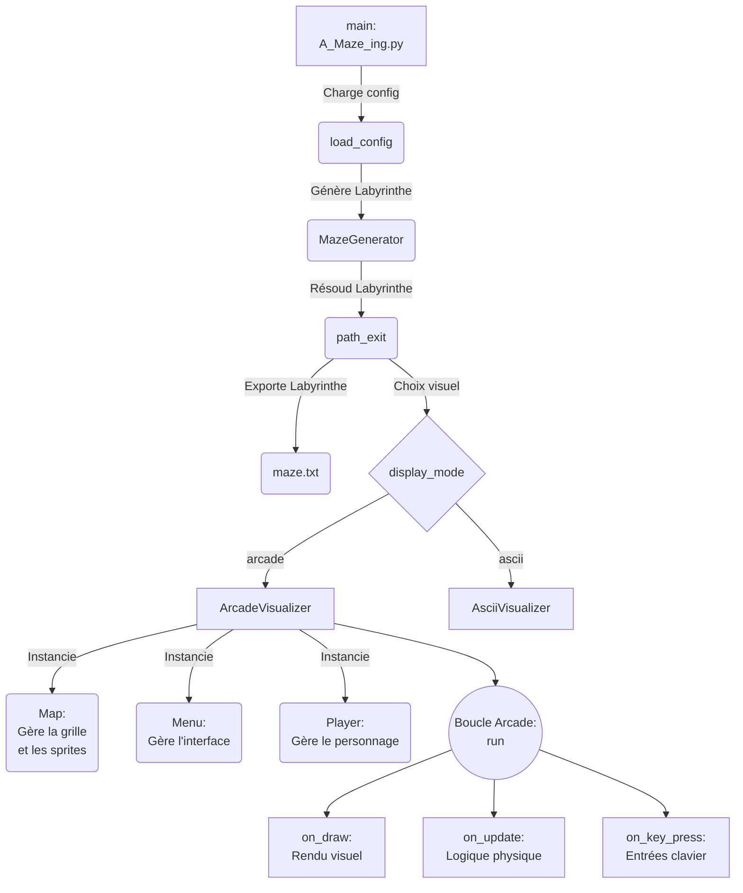
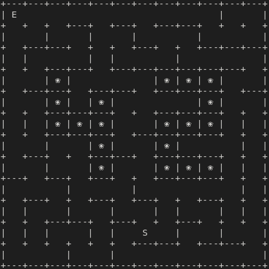
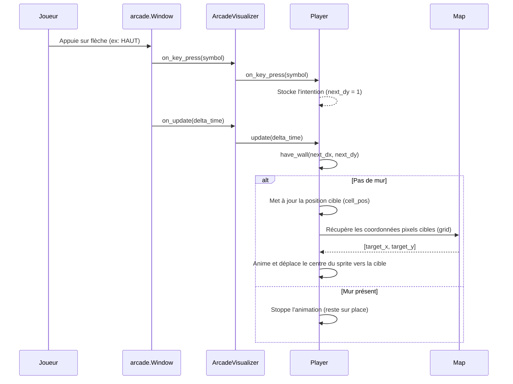

*This project has been created as part of the 42 curriculum by emarette and vadamavi.*

# Description du projet

### But du projet

Ce projet a été réalisé dans le cadre du tronc commun de 42, conformément au sujet  "A_Maze-ing v2.2".

La consigne était d'implémenter en Python un générateur de labyrinthes, à partir d'un fichier de configuration :
+ générer des labyrinthes (parfait, et imparfait avec au maximum 2 culs de sac) ;
+ trouver le chemin le plus court de l'entrée à la sortie ;
+ exporter dans un fichier texte le labyrinthe et sa solution ;
+ fournir une représentation visuelle du labyrinthe ;
+ organiser le code afin que la logique de génération/solution puisse être réutilisée ultérieurement.

{ToDo} *Objectif pédagogique : structures de données, algorithmes de graphes, parsing de configuration*

{ToDo} *Motivation personnelle : Arcade, pytest*


### Sommaire

[1. Instructions](<#1-instructions>)

[2. Fichier de configuration](<#2-fichier-de-configuration>)

[3. Fichier de sortie](<#3-fichier-de-sortie>)

[4. Module réutilisable](<#4-module-réutilisable>)

[5. Architecture](<#5-architecture>)

[6. Algorithmique](<#6-algorithmique>)

[7. Affichage / interactions](#7-affichage--interactions)

[8. Bonus](<#8-bonus>)

[9. Gestion d'équipe et de projet](#9-gestion-déquipe-et-de-projet)

# 1/ Instructions
{ToDo}: *création du package (build backend utilisé — `hatchling`, `setuptools`, `poetry`, etc. — et la commande exacte, par ex. `python -m build`) *


### Prérequis
- Python 3.10 ou supérieur
- uv pour la gestion des dépendances

### Installation

```bash
git clone <url_du_repo>
cd <nom_du_repo>
make install
```

### Exécution

```bash
python3 a_maze_ing.py config.txt
```

- `a_maze_ing.py` est le point d'entrée du programme.
- `config.txt` est le fichier de configuration (voir [par ici]), un exemple par défaut est fourni à la racine du dépôt.

### Makefile

|Cible|Rôle|Obligatoire|
|---|---|---|
|`all`|Installe les dépendances du projet|   |
|`install`|Installe les dépendances du projet|✔️|
|`update`|force la mise à jour de uv.lock si besoin|   |
|`test`|Lance les tests pytest|   |
|`run`|Lance le programme principal|✔️|
|`build`|génère l'archive|✔️|
|`debug`|Lance le programme en mode debug (`pdb`)|✔️|
|`lint`|Exécute `flake8` et `mypy` (règles obligatoires)|✔️|
|`lint-strict`|Exécute `flake8` et `mypy --strict`|✔️|
|`clean`|Supprime les fichiers temporaires (`__pycache__`, `.mypy_cache`…)|✔️|
|`fclean`|Supprime l'environnement virtuel (`.venv`, `uv.lock`…)|   |
|`fclean`|Supprime l'environnement virtuel (`.venv`, `uv.lock`…)|   |

[Haut page](<#description-du-projet>)

# 2/ Fichier de configuration
Le fichier de configuration contient une paire `CLÉ=VALEUR` par ligne. Les lignes commençant par `#` sont des commentaires et sont ignorées.

| Clé            | Description                             | Exemple                | Obligatoire |
| -------------- | --------------------------------------- | ---------------------- | ----------- |
| `WIDTH`        | Largeur du labyrinthe (en cellules)     | `WIDTH=20`             | ✔️          |
| `HEIGHT`       | Hauteur du labyrinthe                   | `HEIGHT=15`            | ✔️          |
| `ENTRY`        | Coordonnées de l'entrée (x,y)           | `ENTRY=0,0`            | ✔️          |
| `EXIT`         | Coordonnées de la sortie (x,y)          | `EXIT=19,14`           | ✔️          |
| `OUTPUT_FILE`  | Nom du fichier de sortie                | `OUTPUT_FILE=maze.txt` | ✔️          |
| `PERFECT`      | Labyrinthe parfait (un seul chemin)     | `PERFECT=True`         | ✔️          |
| `SEED`         | Graine de génération (reproductibilité) | `SEED=42`              | optionnel   |
| `DISPLAY_MODE` | Mode d'affichage (`arcade` / `ascii`)   | `DISPLAY_MODE=arcade`  | optionnel   |

{ToDo}: *valeurs par défaut*
{ToDo}: *comportement en cas d'erreur de syntaxe ou de valeur invalide*

[Haut page](<#description-du-projet>)

# 3/ Fichier de sortie

Chaque cellule est encodée par un digit hexadécimal représentant l'état de ses murs : 

| Bit (LSB → MSB) | Direction |
| --------------- | --------- |
| 0               | Nord      |
| 1               | Est       |
| 2               | Sud       |
| 3               | Ouest     |

Un mur fermé positionne le bit correspondant à `1`. Par exemple :
+ b0011 : murs sud et ouest ouverts
+ b1010 : murs nord et sud ouverts

Les cellules sont écrites ligne par ligne.

Ensuite, après une ligne vide, trois lignes supplémentaires précisent :
+ les coordonnées d'entrée,
+ les coordonnées de sortie,
+ le plus court chemin, avec une suite de lettres pour désigner la direction à prendre (`N`, `E`, `S`, `W`).

Exemple :

```text
913955111555515515395153
ac2a9102829113855692c3a92
...

1,1
19,14
ESEENEEESSSEESESSESESSSSSEEEEESES
```

[Haut page](<#description-du-projet>)

# 4/ Module réutilisable

La logique de génération est isolée dans la classe **`MazeGenerator`** (`src/mazegen.py`).
Elle est packagée en un module autonome (`mazegen-*.whl` / `mazegen-*.tar.gz`) fourni à la racine du dépôt et installable via `pip` :
```bash
# Installation du package
pip install mazegen-<version>-py3-none-any.whl
```

### Exemple d'utilisation
```python
from mazegen import MazeGenerator

maze = MazeGenerator(
    width=20,
    height=15,
    entry_coord=(0, 0),
    exit_coord=(19, 14),
    perfect=True,
    seed=42,
)
maze.generate()

# Accès à la structure générée (liste 2D d'entiers, bitmask par cellule pour l'état des murs)
grid = maze.grid
# Accès à une solution (plus court chemin entre l'entrée et la sortie)
solution = maze.exit_path
```

[Haut page](<#description-du-projet>)

# 5/ Architecture
##### Fichiers
{ToDo}: *maj avec projet final*
```text
.
├── .flake8
├── .gitignore
├── .python-version
├── pyproject.toml
├── uv.lock
├── Makefile
├── README.md
├── config.txt                        # Fichier de configuration par défaut
├── [!] debug_utils.py
├── a_maze_ing.py                     # Point d'entrée (main)
├── src
│   ├── mazegen.py                    # Génération (DFS) et résolution (BFS) du labyrinthe
│   └── maze_app
│       ├── parsing                   # Lecture et validation (Pydantic) du fichier de config
│       │   ├── config_main.py
│       │   ├── config_parser.py
│       │   └── models.py
│       ├── display                   # Visualiseurs ASCII et graphique (arcade)
│       │   ├── __init__.py
│       │   ├── visualizer.py
│       │   ├── ascii_visualizer.py
│       │   ├── arcade_visualizer.py
│       │   ├── map.py                # Grille et sprites
│       │   ├── menu.py               # Interface utilisateur
│       │   ├── player.py             # Déplacement du personnage
│       │   └── sprite
│       │       ├── background.jpeg
│       │       ├── bordure.png
│       │       ├── e.png
│       │       ├── exit.png
│       │       ├── path.png
│       │       └── player.png
│       └── output                    # Écriture du fichier de sortie
│           └── export.py
└── tests
    ├── ToDo
    └── test_player.py
```

##### Flux global
{ToDo}: *maj mef avec styles persos, verif avec Enzo*


[Haut page](<#description-du-projet>)

# 6/ Algorithmique

4 algorithmes générateurs de labyrinthes parfaits ont été comparés :

| Algorithme               | Difficulté | Texture                     | Biais       | Vitesse     |
| ------------------- | ---------- | --------------------------- | ----------- | ----------- |
| Binary Tree         | ⭐          | Diagonale marquée           | Fort        | Très rapide |
| DFS / Backtracking  | ⭐          | Longs couloirs sinueux      | Moyen       | Rapide      |
| Prim randomisé      | ⭐⭐         | Branches courtes, organique | Faible      | Rapide      |
| Kruskal randomisé   | ⭐⭐⭐        | Très homogène               | Très faible | Moyen       |

Le choix s'est porté sur le Backtracking récursif (DFS randomisé) :
+ génère naturellement un labyrinthe parfait (arbre couvrant)
+ plutôt facile à coder → idéal pour un 1er projet
+ rapide, faible consommation mémoire relative, complexité en O(n)
+ génère très peu de branches → ressemble à un "labyrinthe classique"
+ beaucoup de longs couloirs, donc peu de culs de sacs → ne génère pas de zone ouverte de 3x3 lors du braiding

Principe :
+ Creuse un chemin au hasard en avançant dans une direction aléatoire ; quand on est bloqué, on revient en arrière (backtrack) jusqu'à trouver une case avec une issue.

### Génération
Le labyrinthe est généré par **`MazeGenerator`** (`src/mazegen.py`) :

1. Toutes les cellules démarrent fermées (4 murs).
2. Depuis la cellule courante, une cellule adjacente non visitée est choisie aléatoirement, le mur entre les deux est cassé (`_break_wall`), puis on poursuit itérativement (backtracking) jusqu'à épuisement.
3. Si `PERFECT=False`, le labyrinthe est ensuite "cassé" partiellement (`make_imperfect`) pour supprimer des culs de sacs et le rendre jouable façon Pac-Man, tout en respectant les contraintes du sujet (pas de couloir de largeur supérieure à 2 cellules, connectivité totale, motif "42" visible…).
4. La résolution du chemin le plus court entre l'entrée et la sortie est calculée par parcours en largeur (**BFS**, `path_exit` / `solve_maze`).

{ToDo} *ajout graph Mermaid*

### Résolution
{ToDo} *justif choix de BFS + ajout graph Mermaid*

[Haut page](<#description-du-projet>)

# 7/ Affichage / interactions

Deux modes de rendu sont disponibles, sélectionnables via la configuration (`DISPLAY_MODE`) :
- **`ascii`** : rendu texte directement dans le terminal.
- **`arcade`** : rendu graphique via la librairie [`arcade`](https://api.arcade.academy/), avec sprites (murs, joueur, sortie, chemin) et un menu interactif.
### ASCII

Interactions disponibles :
1. Régénérer un nouveau labyrinthe, en choisissant la seed.
2. Afficher / masquer le plus court chemin entre l'entrée et la sortie.
3. Changer les couleurs des murs.
4. Quitter.


### Arcade


Interactions disponibles :
1. Déplacer le joueur.
2. Régénérer un nouveau labyrinthe.
3. Afficher / masquer le plus court chemin entre l'entrée et la sortie.
4. Changer les couleurs des murs.
5. Quitter.

Flèches :arrow_up: / :arrow_down: pour se déplacer dans le menu

Espace pour valider

Flèches :arrow_up: / :arrow_down: et :arrow_left: / :arrow_right: pour se déplacer le joueur dans le labyrinthe

[Haut page](<#description-du-projet>)

# 8/ Bonus
- déplacements du joueur avec Arcade
- labyrinthe imparfait sans cul-de-sac
- sons / musique
- 
- ? animation de l'affichage (! pas de la génération) du labyrinthe en ASCII
- ? modif couleur du Pattern 42
- ? modif forme du pattern
- ? paramètres en ligne de commande : seed, display_mode, perfect
  et/ou affichage des paramètres : seed et perfect

[Haut page](<#description-du-projet>)

# 9/ Gestion d'équipe et de projet

### Répartition des rôles
Emarette avait déjà validé le projet, nous nous sommes donc réparti le travail de façon à ce qu'il ne réalise pas les mêmes tâches qu'avec son précédent binôme.

| Membre   | Rôle                                                             |
| -------- | ---------------------------------------------------------------- |
| emarette | affichage Ascii, affichage Arcade                                |
| vadamavi | makefile, parsing, generator, solver, readme                     |
| both     | .gitignore, architecture, Flake8 et mypy, type hints, docstrings |
| ?        | build                                                            |

### Planning prévisionnel et évolution concrète
Nous avons estimé le temps nécessaire pour les tâches indispensables mais pas fixé d'échéance compte tenu du contexte :
+ bonus à définir
+ congés personnels car période estivale
+ occupation variable des clusters par les piscineux.

Ce qui a pris plus de temps que prévu :
+ génération des labyrinthes imparfaits, le passage du sujet de la version v2.1 à la version v2.2 a ajouté des contraintes.
+ 

{ToDo ?} : *Gantt avec réel +/- simulé (/chgt du sujet)*

### Ce qui a bien fonctionné
+ Mise en place d'une ToDo list pour chaque binône
+ Création du `Makefile` dès le démarrage 
+ Usage de branches pour collaborer avec git

### Axes d'amélioration
L'architecture initialement définie a été remise en question et modifiée peu après le début de l'implémentation du projet.

### Outils collaboration et de développement

Pour collaborer, nous avons fait des points d'étape en **présentiel** régulièrement, communiqué via **Slack** et mutualisé le code sur **Github**.
Le développement a été effectué avec [VSCode](https://code.visualstudio.com/), les traductions en anglais avec [deepl](https://www.deepl.com/fr/translator) et la prise de notes avec [Obsidian](https://obsidian.md/). 
**Outils spécifiques** utilisés : `uv`, `pydantic`, `pytest`, `arcade`, `colorama`, `flake8`, `mypy` …

### Ressources
+ Documentation officielle [`uv`](https://docs.astral.sh/uv/guides/projects/)
+ Documentation officielle [`Pydantic`](https://docs.pydantic.dev/)
+ Wikipedia [Modélisation mathématique d'un labyrinthe](https://fr.wikipedia.org/wiki/Mod%C3%A9lisation_math%C3%A9matique_d%27un_labyrinthe)
+ [Opérateurs-logiques-bit-a-bit](https://datascientist.fr/blog/tutoriel-python-operateurs-bit-a-bit#operateurs-logiques-bit-a-bit)
+ Documentation officielle [`arcade`](https://api.arcade.academy/)
+ Sprites free to use [`pmdcollab.org`](https://sprites.pmdcollab.org/)
+ [Syntaxe Markdown](https://daringfireball.net/projects/markdown/syntax#block)

{ToDO} *? recursive backtracker, BFS, théorie des graphes / arbres couvrants, le packaging Python*

### Usages IA

Gemini a été utilisé par vadamavi pour :
+ relecture et optimisation de code (Makefile) ;
+ créer les flowcharts d'après un modèle Mermaid élaboré "à la main" ;

Claude a été utilisé par vadamavi pour :
+ synthétiser la comparaison des algorithmes de génération de labyrinthe
+ évaluer la probabilité d'apparition, dans des labyrinthes générés avec DFS ou Prim (et de taille variable, jusqu'à 150x150), de zones ouvertes d'au moins 3x3 lors du braiding ;
Deepl 
+ traduire le README en anglais.

{ToDO} *? *Enzo*

{ToDO} *? *génération de test avec pytest*

Tous les fichiers modifiés par IA ont été re-vérifiés par l'un des binômes.


# Licence

Ce projet est distribué sous licence {ToDo par ex. MIT}, voir le fichier `LICENSE.md` à la racine du dépôt.

---
---

Reliquats, à conserver éventuellement en docs perso

---
---

#### Déplacements du joueur
interactions clavier:



---
---
--- 

arbo fat:
```text
.
├── .flake8
├── .gitignore
├── .python-version
├── pyproject.toml
├── uv.lock
├── Makefile
├── README.md
├── config.txt
├── [!] debug_utils.py
├── a_maze_ing.py
│   └── def main(config_path: str) -> None:
├── src
│   ├── mazegen.py
│   │   ├── class MazeGenError(Exception):
│   │   └── class MazeGenerator:
│   │       ├── def __init__(self, width, height, entry_coord, exit_coord, perfect, seed) -> None:
│   │       ├── def grid(self) -> list[list[int]]:
│   │       ├── def exit_path(self) -> str:
│   │       ├── def _break_wall(self, x: int, y: int, direction: int) -> None:
│   │       ├── def _get_unvisited_adjacents(self, x: int, y: int) -> list[tuple[int, int, int]]:
│   │       ├── def _apply_42_pattern(self) -> None:
│   │       ├── def generate_perfect_maze(self) -> None:
│   │       ├── def make_imperfect(self, percent_to_break: float = 0.4) -> None:
│   │       ├── def check_walls_integrity(self) -> bool:
│   │       ├── def is_3x3_open(self, start_x: int, start_y: int) -> bool:
│   │       ├── def free_of_open_areas(self) -> bool:
│   │       ├── def reset(self) -> None:
│   │       ├── def regenerate(self, new_seed: int | None = None) -> None:
│   │       ├── def solve_maze(self) -> str:
│   │       ├── def generate(self) -> None:
│   │       └── 
│   └── maze_app
│       ├── parsing
│       │   ├── config_main.py
│       │   │   └── def load_config(config_path: str) -> MazeConfig:
│       │   ├── config_parser.py
│       │   │   └── def parse_config(file_path: str) -> dict[str, Any]:
│       │   └── models.py
│       │   │   └── class MazeConfig(BaseModel):
│       │   │       ├── def parse_coordinates(cls, value: Any) -> tuple[int, int] | Any:
│       │   │       ├── def lowercase_display_mode(cls, value: Any) -> Any:
│       │   │       ├── def check_extension(cls, value: str) -> str:
│       │   │       └── def validate_config_rules(self) -> 'MazeConfig':
│       ├── display
│       │   ├── __init__.py
│       │   ├── visualizer.py
│       │   │   └── class Visualizer:
│       │   │       └── def __init__(self, mazegen: MazeGenerator):
│       │   ├── ascii_visualizer.py
│       │   │   └── class AsciiVisualizer(Visualizer):
│       │   │       ├── def __init__(self, maze: MazeGenerator):
│       │   │       ├── def draw(self):
│       │   │       ├── def update(self):
│       │   │       ├── def upper_maze(self):
│       │   │       ├── def show_path(self):
│       │   │       └── def _draw_path_char(self, line_index, column_index, symbol="•"):
│       │   ├── arcade_visualizer.py
│       │   │   └── class ArcadeVisualizer(Visualizer, arcade.View):
│       │   │       ├── def __init__(self, maze: MazeGenerator):
│       │   │       ├── def on_draw(self):
│       │   │       ├── def on_update(self, delta_time: float):
│       │   │       └── def on_key_press(self, symbol: int, modifiers: int):
│       │   ├── map.py
│       │   │   └── class Map:
│       │   │       ├── def __init__(self, visualizer) -> None:
│       │   │       ├── def generate_maze(self) -> None:
│       │   │       ├── def build_sprites(self) -> None:
│       │   │       ├── def path(self):
│       │   │       ├── def draw(self) -> None:
│       │   │       └── def calculate_grid(self) -> None:
│       │   ├── menu.py
│       │   │   └── class Menu():
│       │   │       ├── def __init__(self, visualizer) -> None:
│       │   │       ├── def setup_ui(self) -> None:
│       │   │       ├── def draw(self):
│       │   │       ├── def draw_triangle(self) -> None:
│       │   │       ├── def on_key_press(self, symbol: int, modifiers: int) -> None:
│       │   │       └── def execute_action(self) -> None:
│       │   ├── player.py
│       │   │   └── class Player(arcade.Sprite):
│       │   │       ├── def __init__(self, visualizer):
│       │   │       ├── def init_player(self):
│       │   │       ├── def update(self, delta_time):
│       │   │       ├── def on_key_press(self, key: int, modifiers: int) -> None:
│       │   │       └── def have_wall(self, nx: int, ny: int) -> bool:
│       │   └── sprite
│       │       ├── background.jpeg
│       │       ├── bordure.png
│       │       ├── e.png
│       │       ├── exit.png
│       │       ├── path.png
│       │       └── player.png
│       └── output
│           └── export.py
└── tests
    ├── ToDo
    └── test_player.py

[?]
└── doc
    ├── arbo_fat.md
    └── [?] fiches persos
```

---

 
