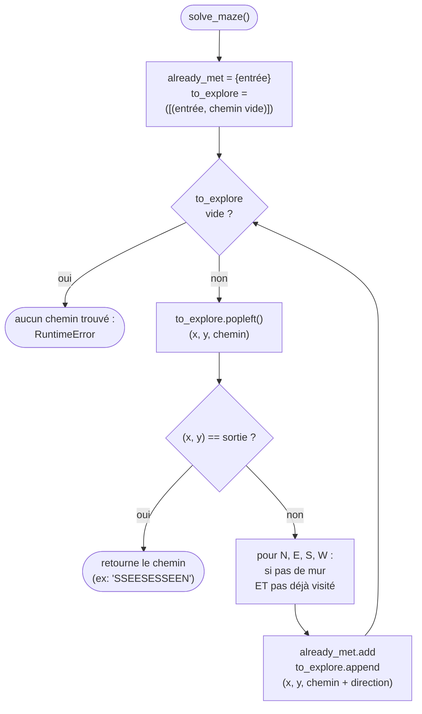

**Principe BFS** : explorer le graphe **niveau par niveau** (tous les voisins à distance *k* avant de passer à distance *k+1*), grâce à une **file** (`collections.deque`).

=> Le premier chemin qui atteint la sortie est nécessairement le plus court.

Le chemin est représenté comme une **chaîne de caractères** (`"N"`, `"E"`, `"S"`, `"W"`), construite au fur et à mesure de l'exploration.