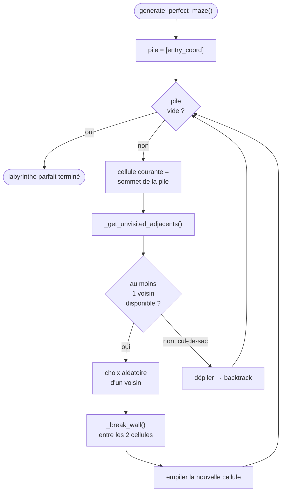

**Principe** : c'est un parcours en profondeur (DFS) qui **creuse un chemin au hasard** ; quand il est bloqué (plus de voisin non-visité), il **revient en arrière** (backtrack) jusqu'à trouver une cellule qui a encore une **sortie inexplorée**. L'algorithme s'arrête quand la pile est vide, c'est-à-dire quand toutes les cellules ont été visitées.

**Motif « 42 »** : avant de lancer le DFS, `_apply_42_pattern()` verrouille un ensemble de cellules (`pattern_cells`) formant le chiffre 42 au centre de la grille, à condition que la grille soit assez grande et que le motif ne recouvre pas l'entrée ou la sortie. Ces cellules sont ensuite exclues des voisins explorables, ce qui les laisse fermées (murs intacts) et donc visibles dans le labyrinthe final.