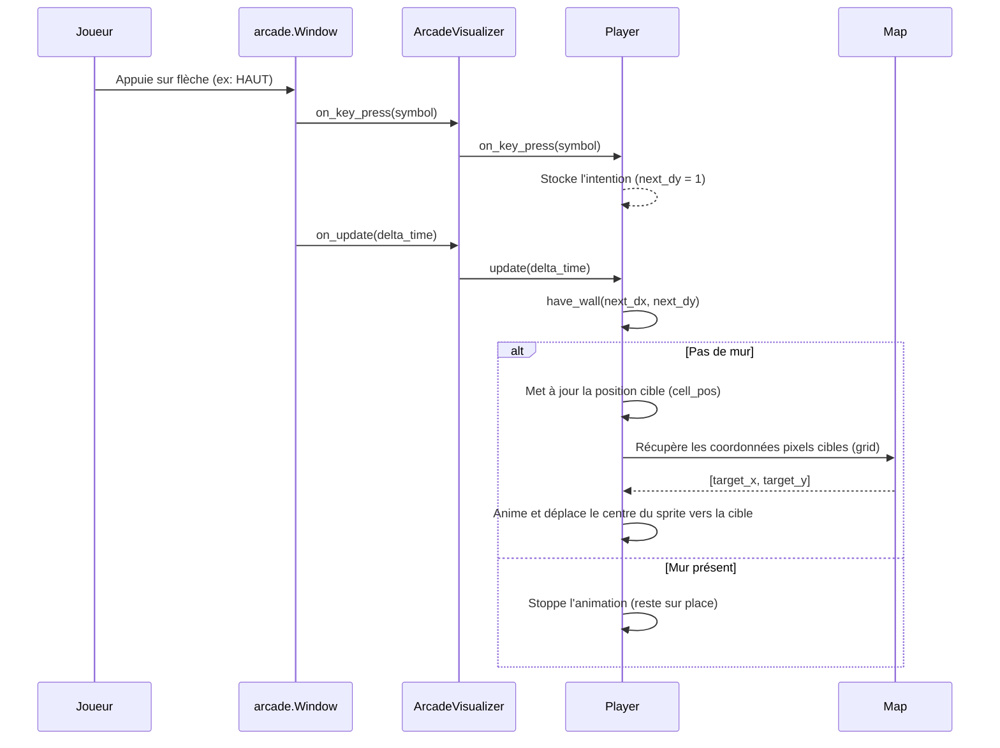

#### Déplacements du joueur
interactions clavier:


---

OLD arbo fat:
```text
.
├── .flake8
├── .gitignore
├── .python-version
├── pyproject.toml
├── uv.lock
├── Makefile
├── README.md
├── config.txt
├── [!] debug_utils.py
├── a_maze_ing.py
│   └── def main(config_path: str) -> None:
├── src
│   ├── mazegen.py
│   │   ├── class MazeGenError(Exception):
│   │   └── class MazeGenerator:
│   │       ├── def __init__(self, width, height, entry_coord, exit_coord, perfect, seed) -> None:
│   │       ├── def grid(self) -> list[list[int]]:
│   │       ├── def exit_path(self) -> str:
│   │       ├── def _break_wall(self, x: int, y: int, direction: int) -> None:
│   │       ├── def _get_unvisited_adjacents(self, x: int, y: int) -> list[tuple[int, int, int]]:
│   │       ├── def _apply_42_pattern(self) -> None:
│   │       ├── def generate_perfect_maze(self) -> None:
│   │       ├── def make_imperfect(self, percent_to_break: float = 0.4) -> None:
│   │       ├── def check_walls_integrity(self) -> bool:
│   │       ├── def is_3x3_open(self, start_x: int, start_y: int) -> bool:
│   │       ├── def free_of_open_areas(self) -> bool:
│   │       ├── def reset(self) -> None:
│   │       ├── def regenerate(self, new_seed: int | None = None) -> None:
│   │       ├── def solve_maze(self) -> str:
│   │       ├── def generate(self) -> None:
│   │       └── 
│   └── maze_app
│       ├── parsing
│       │   ├── config_main.py
│       │   │   └── def load_config(config_path: str) -> MazeConfig:
│       │   ├── config_parser.py
│       │   │   └── def parse_config(file_path: str) -> dict[str, Any]:
│       │   └── models.py
│       │   │   └── class MazeConfig(BaseModel):
│       │   │       ├── def parse_coordinates(cls, value: Any) -> tuple[int, int] | Any:
│       │   │       ├── def lowercase_display_mode(cls, value: Any) -> Any:
│       │   │       ├── def check_extension(cls, value: str) -> str:
│       │   │       └── def validate_config_rules(self) -> 'MazeConfig':
│       ├── display
│       │   ├── __init__.py
│       │   ├── visualizer.py
│       │   │   └── class Visualizer:
│       │   │       └── def __init__(self, mazegen: MazeGenerator):
│       │   ├── ascii_visualizer.py
│       │   │   └── class AsciiVisualizer(Visualizer):
│       │   │       ├── def __init__(self, maze: MazeGenerator):
│       │   │       ├── def draw(self):
│       │   │       ├── def update(self):
│       │   │       ├── def upper_maze(self):
│       │   │       ├── def show_path(self):
│       │   │       └── def _draw_path_char(self, line_index, column_index, symbol="•"):
│       │   ├── arcade_visualizer.py
│       │   │   └── class ArcadeVisualizer(Visualizer, arcade.View):
│       │   │       ├── def __init__(self, maze: MazeGenerator):
│       │   │       ├── def on_draw(self):
│       │   │       ├── def on_update(self, delta_time: float):
│       │   │       └── def on_key_press(self, symbol: int, modifiers: int):
│       │   ├── map.py
│       │   │   └── class Map:
│       │   │       ├── def __init__(self, visualizer) -> None:
│       │   │       ├── def generate_maze(self) -> None:
│       │   │       ├── def build_sprites(self) -> None:
│       │   │       ├── def path(self):
│       │   │       ├── def draw(self) -> None:
│       │   │       └── def calculate_grid(self) -> None:
│       │   ├── menu.py
│       │   │   └── class Menu():
│       │   │       ├── def __init__(self, visualizer) -> None:
│       │   │       ├── def setup_ui(self) -> None:
│       │   │       ├── def draw(self):
│       │   │       ├── def draw_triangle(self) -> None:
│       │   │       ├── def on_key_press(self, symbol: int, modifiers: int) -> None:
│       │   │       └── def execute_action(self) -> None:
│       │   ├── player.py
│       │   │   └── class Player(arcade.Sprite):
│       │   │       ├── def __init__(self, visualizer):
│       │   │       ├── def init_player(self):
│       │   │       ├── def update(self, delta_time):
│       │   │       ├── def on_key_press(self, key: int, modifiers: int) -> None:
│       │   │       └── def have_wall(self, nx: int, ny: int) -> bool:
│       │   └── sprite
│       │       ├── background.jpeg
│       │       ├── bordure.png
│       │       ├── e.png
│       │       ├── exit.png
│       │       ├── path.png
│       │       └── player.png
│       └── output
│           └── export.py
└── tests
    ├── ToDo
    └── test_player.py

[?]
└── doc
    ├── arbo_fat.md
    └── [?] fiches persos
```
